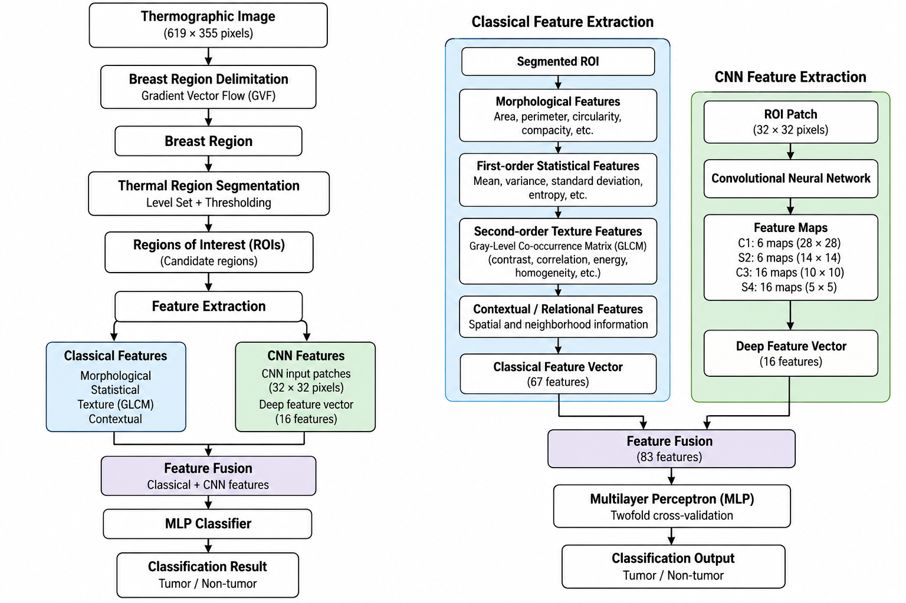
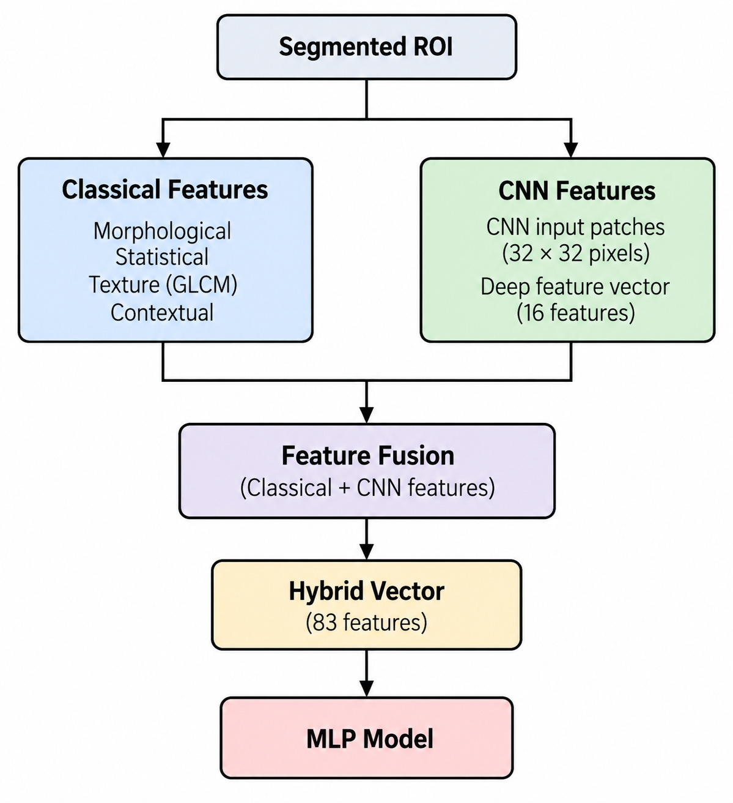

# Breast Cancer Detection in Thermographic Images Using Hybrid Classical and Deep Features

This repository contains the datasets, CNN input images, extracted features, and classification results associated with the research work:

**"Breast Cancer Detection and Segmentation in Thermographic Images Using Classical and Deep Features"**

The repository is intended to support the analysis and documentation of the experimental results reported in the corresponding scientific article.

---

## Abstract

Breast cancer remains one of the leading causes of mortality among women worldwide, highlighting the need for non-invasive and accessible tools for early detection. Breast thermography has emerged as a complementary imaging modality due to its ability to capture abnormal thermal patterns associated with tumor-related vascular activity.

This work proposes a computer-aided system for the detection and segmentation of breast cancer in thermographic images by combining classical image features with deep features extracted from a convolutional neural network (CNN). The methodology includes automatic breast region delimitation using gradient vector flow (GVF), followed by segmentation of thermally relevant regions through a level set–based thresholding approach.

From the segmented regions, classical features describing shape and statistical properties are extracted, along with deep features obtained from the final layer of a CNN. Both feature sets are fused to form a hybrid representation, which is used as input to a multilayer perceptron (MLP) classifier.

The proposed system was evaluated on a dataset of thermographic images from 129 patients, generating 10,679 regions of interest. Using a twofold cross-validation scheme, the method achieved a true positive rate of 99.46%, with 100% precision, an F1-score of 99.54%, and an overall accuracy rate of 99.36%.

These results demonstrate that the integration of segmentation and hybrid feature fusion provides a robust and highly discriminative framework for breast cancer detection in thermographic images. The proposed approach highlights the potential of thermography combined with deep learning as a cost-effective and non-invasive tool to support early breast cancer diagnosis.

---

## Index Terms

Breast cancer, Breast thermography, Computer-aided diagnosis (CAD), Convolutional neural network (CNN), Deep learning, Feature fusion, Level set, Medical image segmentation.

---

## Methodology

The proposed approach follows a multi-stage processing pipeline:

<p align="center">
  
</p>

The methodology combines image processing, segmentation, classical feature extraction, deep feature extraction, feature fusion, and machine learning classification.

### 1. Breast Region Delimitation

The breast region is automatically delimited from the thermographic image using **Gradient Vector Flow (GVF)**.

### 2. Thermal Region Segmentation

Thermally relevant regions are identified using a **Level Set–based thresholding approach**. The segmentation procedure progressively evaluates intensity thresholds to identify regions potentially associated with abnormal thermal patterns.

### 3. Classical Feature Extraction

Classical features are extracted from the segmented regions to describe their morphological and statistical characteristics.

The feature set includes descriptors related to:

* Shape and morphology
* Area
* Perimeter
* Circularity
* Compacity
* Mean intensity
* Variance
* Standard deviation
* Entropy
* Gray-Level Co-occurrence Matrix (GLCM) descriptors
* Contextual and relational properties

### 4. CNN Feature Extraction

Deep features are extracted from the final layer of a convolutional neural network.

The CNN receives image patches extracted from the segmented regions. The input patches have a size of:

**32 × 32 pixels**

The resulting deep representation is combined with the classical feature vector.

### 5. Feature Fusion

Classical and deep features are concatenated to generate a hybrid feature representation.

The fused representation is subsequently used as input to the classifier.

### 6. Classification

A **Multilayer Perceptron (MLP)** classifier is used to classify the generated regions of interest.

The experiments were evaluated using **twofold cross-validation**.

---

## Dataset

The study uses thermographic breast images from **129 patients**.

The original images correspond to full-torso thermographic images with the following characteristics:

| Property           | Description                           |
| ------------------ | ------------------------------------- |
| Number of patients | 129                                   |
| Image format       | BMP                                   |
| Image resolution   | 619 × 355 pixels                      |
| Image type         | RGB thermographic images              |
| Ground truth       | Manually generated segmentation masks |
| Generated ROIs     | 10,679                                |

The extracted regions were divided into:

* **7,473 non-tumor regions**
* **3,206 tumor regions**

The dataset included in this repository corresponds to the data used in the study **before the described preprocessing and segmentation stages**, together with the derived data generated during the experiments.

> **Important:** The thermographic images may contain sensitive biomedical information. Their use should comply with the conditions under which the original dataset was obtained and any applicable institutional, ethical, and data-use requirements.

---

## Repository Contents

The repository is organized according to the main data generated throughout the experimental process.

```text

── dataset/
   ── Original thermographic images

── cnn_input_images/
   ── 32 × 32 CNN input patches

── classical_features/
   ── Classical image features extracted from ROIs

── cnn_features/
   ── Deep features extracted from the CNN

── classification_results/
   ── Classification results and evaluation data
── README.md
```

The exact folder names may vary depending on the organization of the repository.

---

## Data Description

### Original Dataset

Contains the thermographic images used as input to the proposed methodology before preprocessing.

These images represent the initial data from which the breast regions and candidate regions of interest were obtained.

### CNN Input Images

Contains the image patches provided to the convolutional neural network.

Each CNN input image corresponds to a region extracted during the segmentation process.

**Input size:**

```text
32 × 32 pixels
```

### Classical Features

Contains the features calculated from the segmented regions using conventional image-processing and statistical descriptors.

These features characterize properties such as:

* Region geometry
* Intensity distribution
* Texture
* Morphology
* Spatial/contextual information

### CNN Features

Contains the deep feature representations obtained from the CNN.

These features provide a learned representation of the input regions and are subsequently fused with the classical features.

### Classification Results

Contains the classification outputs obtained from the experiments.

The results correspond to the evaluation of the hybrid feature representation using the MLP classifier.

---

## Experimental Results

The proposed approach obtained the following performance:

| Metric                   |      Result |
| ------------------------ | ----------: |
| True Positive Rate (TPR) |  **99.46%** |
| Precision                | **100.00%** |
| F1-score                 |  **99.54%** |
| Accuracy                 |  **99.36%** |

The evaluation was performed using **twofold cross-validation** over the generated regions of interest.

A total of:

**10,679 ROIs**

were generated from the thermographic images.

---

## Feature Representation

The proposed system uses two complementary types of features:

<p align="center">
  
</p>

The motivation for this representation is to combine explicitly defined image descriptors with learned deep representations.

---

## Software and Tools

The original implementation and experiments were developed using:

* **MATLAB**
* **WEKA**
* Convolutional Neural Networks (CNN)
* Multilayer Perceptron (MLP)
* Gradient Vector Flow (GVF)
* Level Set segmentation
* Gray-Level Co-occurrence Matrix (GLCM) analysis

The repository primarily provides the experimental data and results associated with the study. The presence of data and derived features does not necessarily imply that the complete processing pipeline can be reproduced without the original implementation and model parameters.

---

## Reproducibility

The repository provides intermediate and final experimental data intended to facilitate inspection and analysis of the proposed methodology.

The provided materials include:

* Original thermographic images
* CNN input images
* Classical feature vectors
* CNN feature vectors
* Classification results

For complete reproduction of the experiments, the corresponding implementation, trained model parameters, preprocessing configuration, segmentation parameters, and experimental settings may also be required.

---

## Citation

If you use the data, features, results, or methodology presented in this repository, please cite the corresponding article:

```text
Author(s). "Breast Cancer Detection and Segmentation in Thermographic
Images Using Classical and Deep Features." [Journal/Conference],
[Year].
```

The complete citation will be updated once the article has been published.

---

## Research Context

This repository is part of ongoing research on the application of image processing, thermography, machine learning, and deep learning to computer-aided breast cancer analysis.

The objective is not to replace conventional clinical diagnosis, but to investigate computational methods that could potentially serve as complementary tools for the analysis of breast thermographic images.

---

## Disclaimer

The materials provided in this repository are intended for **research and academic purposes only**.

The proposed computational system should not be considered a medical diagnostic device, and the reported results should not be interpreted as evidence that thermography or the proposed algorithm can independently diagnose breast cancer.

Clinical diagnosis must be performed by qualified healthcare professionals using appropriate clinical procedures and diagnostic modalities.

---

## License

A license should be specified according to the conditions under which the dataset, derived features, and code can be redistributed and reused.

If the original thermographic dataset is subject to specific usage restrictions, those restrictions take precedence over the repository license.

---

## Contact

For questions regarding the methodology, experimental data, or research project, please contact the corresponding author of the associated publication.
